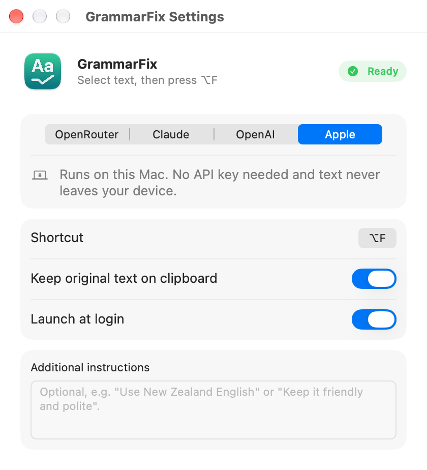

# GrammarFix

A tiny native macOS menu bar app that fixes the grammar of whatever text you have selected, in any app, with one keyboard shortcut.

Select some text, press the shortcut (⌃⌥G by default), and the selection is replaced with the corrected version. Press ⌃⌥H to type one-shot instructions for a single fix.



## Features

- Works in any app that supports copy and paste
- Works out of the box with Apple's on-device model: no API key, no account, and your text never leaves your Mac (macOS 26 or later with Apple Intelligence)
- Or bring your own API key for OpenRouter, Claude (Anthropic) or OpenAI
- Falls back to the on-device model when a provider has no key or a request fails
- Pick any model, with a searchable model list per provider
- Configurable global shortcut, with a check against macOS system shortcuts
- Second shortcut opens a floating field for one-shot extra instructions on a single fix (appended to your saved instructions for that run only)
- Optional extra instructions, e.g. "Use New Zealand English" or "Keep it friendly and polite"
- Keeps your original text on the clipboard after a fix, so you can paste it back if you don't like the result
- API keys are stored in the macOS Keychain
- About 1,200 lines of Swift, no dependencies, no Xcode project

## Requirements

- macOS 13 (Ventura) or later
- For the Apple on-device model: macOS 26 or later on a Mac with Apple Intelligence turned on
- For the other providers: an API key from [OpenRouter](https://openrouter.ai/keys), [Anthropic](https://platform.claude.com/) or [OpenAI](https://platform.openai.com/api-keys)
- Xcode or the Xcode Command Line Tools (`xcode-select --install`) to build from source. Building with the macOS 26 SDK (Xcode 26) or later includes the Apple provider; older SDKs build the app without it

## Download

Get the latest `GrammarFix-x.y.zip` from the [Releases page](https://github.com/aleibovici/grammarfix/releases/latest), unzip it and drag GrammarFix to your Applications folder. The app is signed and notarised by Apple.

Or install it with Homebrew:

```bash
brew install --cask aleibovici/tap/grammarfix
```

## Build from source

```bash
git clone https://github.com/aleibovici/grammarfix.git
cd grammarfix
./build.sh --install
```

This compiles the app, copies it to `/Applications` and launches it. Run `./build.sh` without `--install` to only build `build/GrammarFix.app`.

The build script signs with the first "Apple Development" or "Developer ID Application" certificate it finds in your keychain, and falls back to ad-hoc signing if there is none. Ad-hoc signing works, but macOS will ask you to re-grant Accessibility and Keychain access after every rebuild. To choose a certificate yourself:

```bash
CODESIGN_IDENTITY="Developer ID Application: Your Name (TEAMID)" ./build.sh --install
```

## Releasing

`./release.sh` builds the app, signs it with a Developer ID certificate, notarises it with Apple and writes `build/GrammarFix-<version>.zip`, ready to attach to a GitHub release. The one-time setup is described at the top of the script. Bump `CFBundleShortVersionString` in `Info.plist` first.

## First run

1. Click the GrammarFix icon in the menu bar and open **Settings…**
2. Choose a provider. **Apple** is selected by default when it's available and needs no setup. For OpenRouter, Claude or OpenAI, paste your API key and pick a model.
3. Click **Grant Access…** and enable GrammarFix under System Settings → Privacy & Security → Accessibility. The app needs this to send ⌘C and ⌘V to the app you're typing in.

## How it works

1. A global hotkey (Carbon `RegisterEventHotKey`) fires. The secondary shortcut shows a floating field first; on submit, the typed text is appended to your saved extra instructions for that run only.
2. GrammarFix sends ⌘C to the frontmost app and reads the selection from the clipboard.
3. The text goes to your chosen provider with a fixed system prompt plus your extra instructions. If that provider has no key or the request fails, the Apple on-device model is used instead when it's available.
4. The corrected text is put on the clipboard and pasted with ⌘V.
5. The clipboard is then set to your original text (or restored to what it held before, if you turn that option off).

| File | Purpose |
| --- | --- |
| `Sources/AppDelegate.swift` | Menu bar item, menu, settings window |
| `Sources/TextFixer.swift` | Copy, fix and paste flow; clipboard handling |
| `Sources/GrammarAPI.swift` | Providers, system prompt, HTTP requests, on-device model |
| `Sources/HotKey.swift` | Global hotkey registration and conflict check |
| `Sources/OneShotPrompt.swift` | Floating one-shot instructions field |
| `Sources/Settings.swift` | Preferences and Keychain storage |
| `Sources/SettingsView.swift` | SwiftUI settings window and shortcut recorder |
| `make-icon.swift` | Regenerates `AppIcon.icns` (`swift make-icon.swift`) |

## Privacy

- The text you select is sent to the provider you chose (OpenRouter, Anthropic or OpenAI) and to nobody else. Their privacy and data retention terms apply. With the Apple on-device provider, the text never leaves your Mac.
- GrammarFix has no analytics, no telemetry and no server of its own.
- API keys are stored in your login Keychain and are only sent to the matching provider.
- Be careful with sensitive text: unless you use the Apple on-device provider, anything you select when you press the shortcut leaves your machine.

## Limitations

- Apps that block synthetic copy/paste, and secure input fields such as password boxes, won't work.
- Only plain text is corrected; rich formatting inside the selection (bold, links) is replaced by plain text.
- The Apple on-device model is small. It's fast and private, but less accurate than the cloud models on subtle grammar, and long selections can exceed its context window.
- Shortcut conflicts with other third-party apps can't be detected, only conflicts with macOS system shortcuts.
- Builds from source aren't notarised. If you distribute one, other Macs will show a Gatekeeper warning unless you sign it with a Developer ID and notarise it.

## Contributing

Issues and pull requests are welcome. See [CONTRIBUTING.md](CONTRIBUTING.md).

## License

[MIT](LICENSE)
